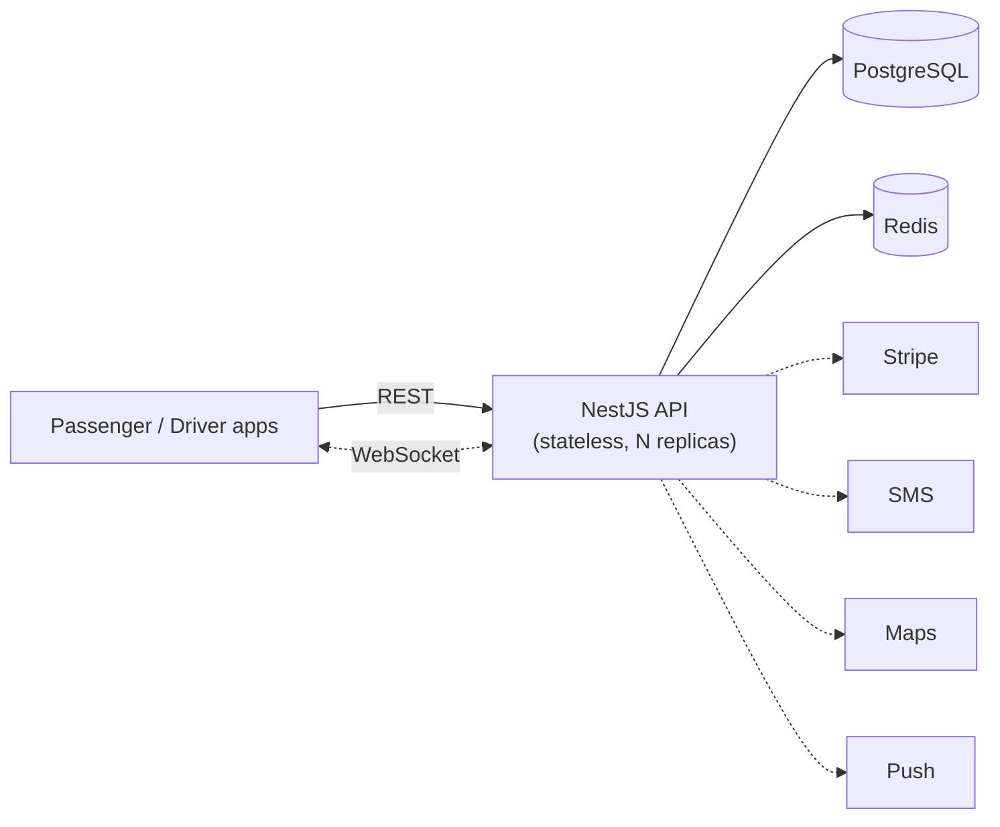
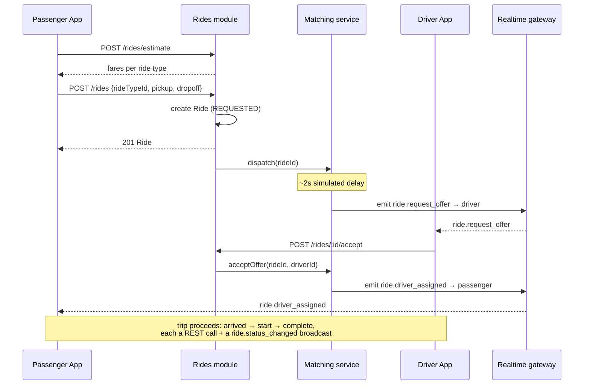

# Zwakala — System Architecture

Companion to `schema.prisma` / `erd.mermaid`, `openapi.yaml` / `api-design-notes.md`, and
the `zwakala-api` backend skeleton built earlier in this thread. This document is the
"why it's shaped this way" — how the pieces fit together, what happens under load, and
what's deliberately deferred past MVP.

## 1. Scope

Covers the passenger + driver core loop: authenticate, estimate a fare, request a ride,
get matched, run the trip, pay, rate. It does **not** cover fleet management, a dispatch
console, an admin dashboard, corporate accounts, or multi-currency/multi-country — each
of those is an additive module on top of this foundation, not a redesign of it. This
scope boundary has been consistent across the schema, the API spec, and the backend, on
purpose: it's the same product decision made once and referenced everywhere.

## 2. High-level view

See `architecture-diagram.mermaid` for the full diagram. In short:



The API is a single NestJS service organized into feature modules (Auth, Users,
RideTypes, Rides, Driver, Payments, Wallet, Promo, Realtime) rather than separate
microservices. At MVP scale — one city, one ride-type catalogue, no fleet ops — a
modular monolith is the right call: one deploy pipeline, one transaction boundary
around the ride state machine (which touches Rides, Payments, and Wallet together),
and no network hop between services that are going to call each other constantly. The
module boundaries are drawn so that splitting Payments or Realtime into their own
service later is a matter of moving files and adding a queue, not a rewrite.

## 3. Why a modular monolith, not microservices (yet)

The tempting split would be one service per domain (rides, payments, matching,
notifications). Two things argue against that at this stage:

- **The ride state machine is a single transaction.** Completing a ride updates the
  ride row, increments the driver's trip count, and triggers a payment charge — see
  `RidesService.complete()` in the skeleton. Keeping that in one process means one
  Postgres transaction; splitting it means either distributed transactions (avoid) or
  eventual consistency with compensating actions (real complexity for no current
  payoff, since there's no team-scaling reason to split yet).
- **Team size drives service boundaries, not the other way around.** Microservices pay
  for themselves when multiple teams need to deploy independently. One team building an
  MVP gets nothing from the split except deployment overhead and network latency
  between calls that used to be function calls.

The trigger to actually split something out is a real scaling bottleneck (e.g. the
realtime gateway needing independent scaling from the REST API under matching load),
not a stylistic preference for microservices.

## 4. Request flow: requesting a ride



REST and WebSocket are doing different jobs here, deliberately: REST is for
*commands* (things a client asserts happened — "I'm requesting a ride," "I've
arrived"), WebSocket is for *state fan-out* (telling every interested party
something changed, without them polling for it). A client that loses its socket
connection can always fall back to `GET /rides/{id}` to resync — the REST layer is
never dependent on the socket layer being up.

## 5. Data layer

**PostgreSQL** is the system of record — see `erd.mermaid`. Money fields are `Decimal`,
never `Float`, because fare calculations sum across base fare, distance fare, time
fare, surge, and promo discount, and float rounding drift compounds across millions of
rides.

**Redis** is drawn into the architecture but not yet in the backend skeleton — the
skeleton keeps OTP codes and ride-offer state in an in-memory `Map`, which is called
out explicitly in the code comments as a single-instance limitation. Redis is where
that state moves the moment there's more than one API replica:

- OTP codes (short TTL, needs to be readable by whichever replica handles `/verify`)
- Active ride offers (`rideId → driverId` currently holding an offer) — same reasoning
- WebSocket pub/sub adapter, so a `ride.status_changed` emitted from the replica that
  handled the REST call reaches a socket connection held open on a *different* replica
- Driver geo-index (Redis `GEO` commands) once matching becomes "nearest driver" instead
  of "any online driver" — the current skeleton does the latter on purpose, flagged as
  the first thing to replace

## 6. Scaling the realtime layer

This is the one part of the architecture that doesn't scale "for free" by adding API
replicas, and it's worth being explicit about why. A passenger's WebSocket connection
is held open on *one specific* replica. If the event they need to receive
(`ride.driver_assigned`) is generated by request-handling code running on a *different*
replica, that event has to cross replicas to reach them. The standard fix — and the
reason Redis appears in the diagram even though the skeleton doesn't need it yet at
one-instance scale — is Socket.IO's Redis adapter: every replica publishes outgoing
events to a shared Redis pub/sub channel, and every replica's socket layer subscribes
to it, so it doesn't matter which replica originated the event or which replica is
holding the relevant connection.

## 7. External dependencies and their swap points

Every external integration is mocked in the backend skeleton behind an interface
that's already shaped for the real thing, so swapping one in doesn't touch calling
code:

| Concern | Mocked as | Real integration | Swap point |
|---|---|---|---|
| OTP delivery | Logged to console | Twilio (or similar SMS API) | `AuthService.requestOtp` |
| Card charges | Always succeeds, ~150ms delay | Stripe PaymentIntents | `PaymentsService.chargeCard` |
| Routing/ETA | Haversine distance × fudge factor | Google Directions / Mapbox | `PricingService.estimateRoute` |
| Push notifications | Not implemented | FCM / APNs | New method on `RealtimeGateway`, triggered alongside socket emits for backgrounded apps |

None of these are architectural risks — they're bounded, single-file swaps because the
module boundaries were drawn around *what* the system needs (a way to notify a phone
number, a way to charge a card) rather than around a specific vendor's SDK shape.

## 8. Security posture (MVP-appropriate, not final)

- **AuthN**: phone OTP → short-lived JWT access token + longer-lived refresh token.
  Refresh tokens are currently stateless (not revocable server-side) — the API design
  notes already flag persisted/rotatable refresh tokens as the next step, needed
  before this handles anything more sensitive than a ride-hailing MVP.
- **AuthZ**: every ride-state-changing endpoint checks that the caller is an actual
  party to that ride (the assigned driver, or the requesting passenger) — enforced in
  `RidesService`, not left to the client to behave honestly.
- **Payment data**: card details never touch this backend — `PaymentMethod` stores a
  provider token and display metadata (brand, last 4) only, matching PCI SAQ-A scope
  rather than SAQ-D.
- **Rate limiting**: called for in the OpenAPI spec (`429` on OTP request) but not yet
  implemented in the skeleton — sits naturally at the API gateway/load-balancer layer
  rather than in application code, so it's an infra addition, not a code change.

## 9. Deployment shape (MVP)

```
Load balancer (TLS termination)
    │
    ├── API replica 1 ─┐
    ├── API replica 2 ─┼── all stateless, horizontally scaled on request volume
    └── API replica N ─┘
    │
    ├── PostgreSQL (single primary + read replica once read load justifies it)
    └── Redis (OTP/offer state, socket pub/sub)
```

Nothing here needs Kubernetes-level orchestration at MVP traffic — a managed Postgres
(RDS/Cloud SQL), managed Redis, and 2-3 container replicas behind a load balancer is
enough runway to validate the product before investing in more infrastructure than the
traffic justifies.

## 10. What changes first as this grows

Roughly in the order real usage would force each one:

1. **Redis for OTP/offer state + socket adapter** — the moment there's a second API
   replica, which happens the first time traffic exceeds what one instance handles.
2. **Real geo-matching** — the moment there's more than a handful of concurrent online
   drivers and "any online driver" stops being an acceptable proxy for "nearest driver."
3. **Persisted/rotatable refresh tokens** — before this handles real payment volume.
4. **Splitting the Realtime gateway into its own deployable** — only if socket
   connection volume specifically becomes the bottleneck, independent of REST traffic.
5. **Fleet management, dispatch console, admin dashboard** — new modules alongside the
   existing ones, not a rework of them, since the schema and API were scoped with this
   boundary in mind from the start.
